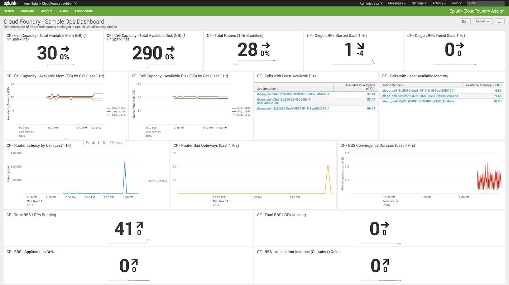

# Splunk Add-on for Cloud Foundry
https://github.com/splunk/splunk-addon-for-cloud-foundry

Splunk Add-on for Cloud Foundry is used to parse, analyze & visualize [Cloud Foundry Firehose](https://docs.cloudfoundry.org/loggregator/architecture.html#firehose) data which includes metrics from all Cloud Foundry system components, in addition to logs and metrics from all applications.  It provides several prebuilt panels targeted for Cloud Foundry operators to help them easily build dashboards and gain operational visibility over their Cloud Foundry deployments.

## Prerequisites
Splunk Add-on for Cloud Foundry is a Supporting Add-on, and as such, it does **not** contain any inputs. It is used in conjunction with [Splunk Firehose Nozzle](https://github.com/cloudfoundry-community/splunk-firehose-nozzle) which collects data from Cloud Foundry Firehose and forwards it to a Splunk deployment.

For BOSH-managed deployment of Splunk Firehose Nozzle, refer to [Splunk Firehose Nozzle BOSH release](https://github.com/cloudfoundry-community/splunk-firehose-nozzle-release) which deploys the nozzle along with a co-located pre-configured Splunk forwarder to forward to one or more Splunk indexers in a reliable, secure & scalable manner.

## Installing Splunk Add-on for Cloud Foundry
Splunk Add-on for Cloud Foundry is installed on Splunk search head(s).
Download the Add-on from [Splunkbase]() then upload the .spl file either directly via [Splunk UI](http://docs.splunk.com/Documentation/AddOns/released/Overview/Singleserverinstall) or Splunk CLI in case of a single instance Splunk deployment. For a distributed Splunk deployment, you may want to install it via Splunk [deployment server](http://docs.splunk.com/Documentation/Splunk/latest/Updating/Aboutdeploymentserver) or Splunk [search head cluster deployer](http://docs.splunk.com/Documentation/Splunk/latest/DistSearch/PropagateSHCconfigurationchanges) (in case of a search head cluster), or your favorite 3rd party configuration management tool.

Alternatively, for development purposes, you can clone this repo and copy/symlink it under `etc/apps/` directory of your Splunk installation.

## Using Splunk Add-on for Cloud Foundry

### Sourcetypes
Splunk Add-on for Cloud Foundry expects the following data sourcetypes which are automatically assigned by Splunk Firehose Nozzle to each streaming Firehose event based on its type before forwarding it to Splunk. For detailed descriptions of each Firehose event type and their fields, refer to underlying [dropsonde protocol](https://github.com/cloudfoundry/dropsonde-protocol).

| Splunk sourcetype | Firehose event type | Description
|---|---|---
| `cf:error` | Error | An Error event represents an error in the originating process
| `cf:httpstartstop` |  HttpStartStop | An HttpStartStop event represents the whole lifecycle of an HTTP request
| `cf:logmessage` | LogMessage | A LogMessage contains a "log line" and associated metadata
| `cf:containermetric` | ContainerMetric | A ContainerMetric records resource usage of an app in a container
| `cf:counterevent` | CounterEvent | A CounterEvent represents the increment of a counter
| `cf:valuemetric` | ValueMetric | A ValueMetric indicates the value of a metric at an instant in time

In addition, logs from the nozzle itself are of sourcetype `cf:splunknozzle`.

### Prebuilt Panels
Splunk Add-on for Cloud Foundry provides several prebuilt panels that you can immediately add to your own Cloud Foundry operational dashboards. Refer to [Add panels to dashboards](http://docs.splunk.com/Documentation/Splunk/latest/Viz/AddPanels#Add_panels_using_the_Dashboard_Editor) in Splunk Docs for more information.

## Resources

### Splunk Firehose Nozzle
* https://github.com/cloudfoundry-community/splunk-firehose-nozzle
* https://github.com/cloudfoundry-community/splunk-firehose-nozzle-release

### Cloud Foundry Loggregator & Nozzles
* https://docs.cloudfoundry.org/loggregator/architecture.html#firehose
* https://docs.pivotal.io/pivotalcf/1-8/loggregator/log-ops-guide.html

## Support
This is a community supported Add-on. As such, please post questions in [Splunk Answers](https://answers.splunk.com/) and reference it. Someone should be with you shortly.
Pull requests via github are welcome!

## License and Authors
* Authors: Roy Arsan rarsan@splunk.com, Matt Cholick mcholick@pivotal.io
* Copyright 2016 Splunk, Inc.

Splunk Add-on for Cloud Foundry is licensed under the Apache License 2.0.

Details can be found in the [LICENSE file](https://github.com/splunk/splunk-addon-for-cloud-foundry/blob/master/LICENSE).

